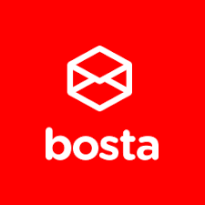

# 👋 Hi, I'm Sohaila Hakeem

I'm a passionate **Software Engineer** based in Cairo, Egypt, with a strong foundation in full-stack development. I am currently expanding my expertise at [TRU](https://www.linkedin.com/company/truapp/posts/?feedView=all). Previously, I worked at [Amazon Payment](https://www.amazon.com) , [Procore technologies](https://www.procore.com/en-ae), [EJADA](https://www.ejada.com/) and [Bosta](https://bosta.co/en-eg/home).  
 
With a focus on building scalable, efficient, and user-centric solutions, I am continuously honing my skills to solve complex technical challenges.

## 🏢 Companies I worked with

<table border=0 cellspacing=0 cellpadding=0 rules=none align="center"  overflow-y="hidden">
<tr>
<td>
    
</td>
<td>
    
</td>
<td>
    
</td>
<td>
    
</td>
<td>
    
</td>
</table>

## 🛠️ Skills

### Software Engineering

A skill is the building block of a software engineer. Here are some of the bricks I've gathered over the years:

- **🔨 Languages:**   Javascript/Typescript,  Python,  JAVA,  C++,  , 🖥️ VHDL, 🖥️ Verilog
- **☁️ Backend Technologoes**:  Node.js,  Express,  Nest.js,  Django,  Spring Boot,  REST APIs
- **💾 Database & Message Queues:**  PostgreSQL,  MongoDB,  Redis, Firebase , kafka
- **🤿 DevOps & Infrastructure:**  Docker,  Kubernetes,  Nginx,  AWS,  CI/CD, 🪒 Microservices
- **🖨️ Frontend Technologies:**  React.js,  Redux,   Tailwind,  MUI,  Bootstrap,  HTML,  CSS

### Development Methodologies

I believe in the importance of following **best practices** and methodologies to ensure the quality and scalability of the software I build. Here are some of the methodologies I follow:

- **Principles and fundamentals:** OOP, SOLID, Design Patterns, Testing, Deployment, Data Structures, Algorithms
- **Tools:**  Linux,  Git, 🧰 Perforce,  Jira & Confluence,  Postman,  VS Code

## 📫 Get in Touch

Let's connect and build something amazing together!

- **Email:** sohailahakeem17@gmail.com
- **LinkedIn:** [Sohaila Hakeem](https://www.linkedin.com/in/sohaila-hakeem-819801221)
